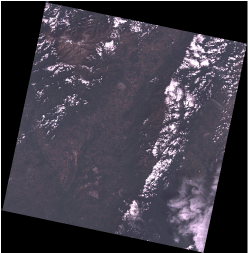
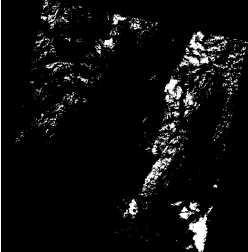
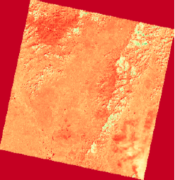
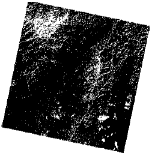

# Erosion identification from Landsat images

This project aims to process satellite acquired images in order to identify erosion in mining regions in Colombia.

## Getting Started

Entire implementation developed in Python. See deployment for notes on how to deploy the project on a live system.

### Prerequisities

In order to deploy the application, you need to install [python](https://www.python.org/downloads/).

### Installing

Pillow
```
pip install Pillow
```
NumPy
```
pip install numpy
```
GDAL
```
easy_install GDAL
```
Scikit-Image
```
pip install -U scikit-image
```
Matplotlib
```
python -m pip install matplotlib
cd matplotlib
python setup.py build
python setup.py install

```
Scipy
```
sudo port install py27-numpy py27-scipy py27-matplotlib py27-ipython +notebook py27-pandas py27-sympy py27-nose
```
Tkinter
```
install python-imaging
```

## Project Example
| <br /><sub>Image in natural color</sub><br />| <br /><sub>Identification of clouds</sub><br /> | <br /><sub>NDVI Index</sub><br /> | <br /><sub>Erosion</sub><br /> |
| :---: | :---: | :---: | :---: |

## Built With

* Python
* Pillow
* NumPy
* GDAL
* Scikit-Image
* Matplotlib
* Scipy
* Tkinter

## Authors

<!-- Contributors table START -->
| [<br /><sub>Meili Vanegas</sub>](https://github.com/mvanegas10)<br /> |
| :---: |

<!-- Contributors table END -->
